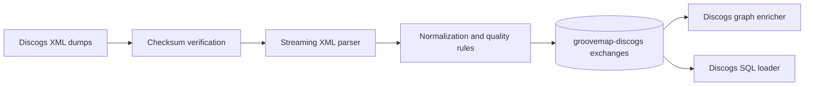

# GrooveMap Discogs ingestion

`discogs-ingestion` downloads, verifies, parses, and normalizes Discogs XML dumps,
then publishes versioned catalog events to RabbitMQ. This repository owns the Discogs
producer, its data-quality rules, event contract, generated bindings, fixtures, state
markers, container image, tests, and release artifacts.



The service publishes artists, labels, masters, and releases. It runs independently
from MusicBrainz ingestion and neither coordinates nor shares a runtime lock with it.

## Development

```bash
mise install
just setup
just check
```

Use `just contract` after changing `contracts/catalog-events/definitions/discogs.json`.
`just image` builds `discogs-ingestion:local`; `just release-dry-run` prepares local
release evidence without publishing, tagging, or pushing.

`just image` is not part of `just check` — the reusable CI already builds the image on
every push. Run `just image` yourself whenever you touch a compile-time `include_str!`
(e.g. a vendored vocabulary under `contracts/catalog-events/vocab`) or anything
else the Docker build context depends on, since `just check` alone won't catch a missing
`COPY`.

### Compiler cache

Rust builds go through [sccache](https://github.com/mozilla/sccache). `.cargo/config.toml`
sets `rustc-wrapper = "sccache"` and `just bootstrap` installs the pinned version from
`.mise.toml`, so every `cargo` recipe reuses previously compiled objects instead of
rebuilding them after a toolchain or dependency change.

The cache lives on local disk outside the repository: `~/Library/Caches/Mozilla.sccache`
on macOS and `~/.cache/sccache` on Linux. Set `SCCACHE_DIR` to move it. Inspect hit rates,
the resolved location, and the current size with:

```bash
sccache --show-stats
```

To compile without the cache for one command, blank the wrapper:

```bash
RUSTC_WRAPPER= just check
```

The image build carries its own cache. The builder stage installs the sha256-verified
sccache musl release and mounts a BuildKit cache at `/root/.cache/sccache`, so a repeated
`just image` reuses objects across builds and prints `sccache --show-stats` when the
application build finishes. That cache is separate from the local one above.

## Telemetry

The extractor pushes OpenTelemetry metrics **and traces** over **OTLP/HTTP-protobuf** to
the collector. There is no gRPC transport and no Prometheus scrape endpoint, and the JSON
`/health`, `/metrics`, `/ready`, and `/trigger` endpoints are unchanged — they remain part
of the service's HTTP contract. Only standard OTEL environment variables are read; there
are no GrooveMap-specific telemetry variables.

| Variable | Effect |
| --- | --- |
| `OTEL_EXPORTER_OTLP_ENDPOINT` | Collector base URL, e.g. `http://otel-collector:4318`. **Unset disables metrics entirely.** |
| `OTEL_EXPORTER_OTLP_METRICS_ENDPOINT` | Per-signal override of the base URL. |
| `OTEL_METRICS_EXPORTER` | `otlp` (default) or `none` to disable export. |
| `OTEL_SERVICE_NAME` | `service.name`; the compose service key, e.g. `extractor-discogs`. Defaults to `discogs-ingestion`. |
| `OTEL_RESOURCE_ATTRIBUTES` | Extra resource attributes, e.g. `service.namespace=groovemap,deployment.environment.name=dev`. |
| `OTEL_METRIC_EXPORT_INTERVAL` | Export period in milliseconds; the SDK default is 60000. |
| `OTEL_TRACES_EXPORTER` | `otlp` (default) or `none` to disable span export. |
| `OTEL_EXPORTER_OTLP_TRACES_ENDPOINT` | Per-signal override of the base URL for spans. |
| `OTEL_TRACES_SAMPLER` | Sampler name; defaults to `parentbased_traceidratio`. |
| `OTEL_TRACES_SAMPLER_ARG` | Sampling ratio, 0.0–1.0. Compose sets 1.0 in dev and 0.1 in the prod overlay. |

`service.version` is always set from the crate version, and the `source` attribute on every
domain metric is the constant `discogs`.

Telemetry never fails startup: with no endpoint configured the bootstrap logs once and
installs no-op providers. Metric export runs on a periodic reader and span export on a
batch span processor, each on its own thread off the extraction path, and both are flushed
on shutdown. With traces disabled the global propagator stays a no-op, so a published
message carries no trace headers and is byte-identical to one published before tracing
existed.

Instruments emitted:

| Instrument | Kind | Attributes |
| --- | --- | --- |
| `groovemap.extraction.records` | counter | `source`, `entity` |
| `groovemap.extraction.files` | counter | `source`, `outcome` |
| `groovemap.extraction.file.progress` | gauge (0..1) | `source`, `entity` |
| `groovemap.extraction.download.bytes` | counter (`By`) | `source` |
| `groovemap.extraction.publish.confirm.duration` | histogram (`s`) | `source` |
| `groovemap.extraction.errors` | counter | `source`, `stage` |
| `messaging.client.sent.messages` | counter | `messaging.system`, `messaging.destination.name` |
| `groovemap.pipeline.reconnects` | counter | `system` |

Runtime instruments are observable: the SDK reads them on the exporter's own thread at
collection time, so nothing on the extraction path pays for them. The `process.*` family
reads `/proc/self` and needs no extra crate; off Linux those four instruments are not
registered at all, so the series is absent rather than a misleading zero. The tokio gauges
use only the stable `RuntimeMetrics` accessors — nothing behind `--cfg tokio_unstable`.

| Instrument | Kind | Attributes |
| --- | --- | --- |
| `process.cpu.time` | counter (`s`), Linux only | `cpu.mode` (`user`, `system`) |
| `process.memory.usage` | gauge (`By`, RSS), Linux only | — |
| `process.thread.count` | gauge, Linux only | — |
| `process.open_file_descriptor.count` | gauge, Linux only | — |
| `groovemap.runtime.tokio.workers` | gauge | — |
| `groovemap.runtime.tokio.alive_tasks` | gauge | — |
| `groovemap.runtime.tokio.global_queue_depth` | gauge | — |

Spans emitted, all with low-cardinality names built only from the closed sets the metric
attributes already use. No file name, id, or byte count reaches a span name or attribute,
and no span carries a payload event.

| Span | Kind | Attributes |
| --- | --- | --- |
| `extract {source} {entity}` | internal, root | `source`, `entity` |
| `download` | internal | — |
| `parse` | internal | — |
| `publish {destination}` | producer | `messaging.system`, `messaging.destination.name`, `messaging.operation.name` |

Acquisition and processing are separate phases of a run — every file is downloaded before
the first is parsed — so a file gets one `extract` root for its download and a second for
its parse and publishes, rather than one root spanning both.

Every published message carries the producer span's `traceparent` (and `tracestate` when
one is in play) in its AMQP headers, so a consumer's `process` span joins the extractor's
trace.

See the [documentation index](docs/README.md) and the [contract guide](contracts/catalog-events/README.md).
The project is licensed under the [MIT License](LICENSE).
