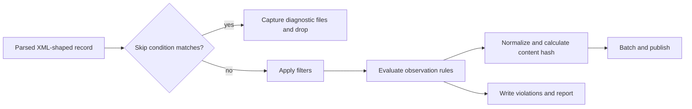
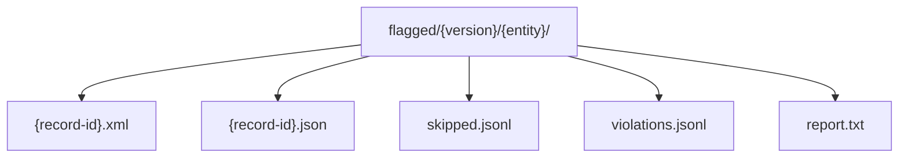

# Extraction rules

The optional extraction-rules engine applies to Discogs XML records after parsing and
before producer normalization and RabbitMQ publication. It supports three distinct
policies:

- `skip_records` drops known junk records.
- `filters` transforms known bad values.
- `rules` records observations without blocking publication.

The authoritative example is source-controlled in this repository, but it is not copied
into the container image or included in the release bundle. The `deployment` repository
must supply it as mounted runtime configuration and pass its path explicitly. Consumers
must not duplicate these transforms.

## Enable the rules engine

Pass a YAML path on the command line or in the environment:

```bash
cargo run --locked -- \
  --source discogs \
  --data-quality-rules ./extraction-rules.yaml

DATA_QUALITY_RULES=/config/extraction-rules.yaml \
  cargo run --locked -- --source discogs
```

The repository provides [`extraction-rules.yaml`](../extraction-rules.yaml) as the
source-controlled policy, but the binary does not load it implicitly and the Dockerfile
does not bake it into the image. Deployment must mount or otherwise supply the file at
the configured path. If neither option is set, skip, filter, validation, and
flagged-record capture are disabled. Producer normalization and content hashing remain
enabled.

The file must use a `.yaml` or `.yml` extension. Unknown entity names, invalid regular
expressions, invalid filter types, and malformed YAML fail at startup.

## Processing order



Skip conditions, filters, and rules use the parsed XML shape. For example,
`genres.genre` addresses the `genre` values inside the `genres` container. Normalization
then flattens that shape for consumers.

## YAML structure

All top-level sections are optional:

```yaml
skip_records:
  artists:
    - field: profile
      contains: "DO NOT USE"
      reason: "Upstream junk entry marked DO NOT USE"

filters:
  releases:
    - field: genres.genre
      remove_matching: "^\\d+$"
      reason: "Strip legacy numeric genre IDs"
  masters:
    - field: year
      nullify_when:
        type: range
        below: 1860
        above: 2027
      reason: "Treat implausible years as unknown"

rules:
  releases:
    - name: missing-title
      field: title
      condition:
        type: required
      severity: error
```

Entity keys must be supported catalog data types. The source-controlled example policy
configures Discogs artists, labels, masters, and releases.

## Skip records

A skip condition performs a case-insensitive substring comparison against every value
resolved at `field`. Conditions are evaluated in order and the first match wins. A
skipped record is captured for diagnosis, appended to `skipped.jsonl`, and is neither
validated nor published.

```yaml
skip_records:
  labels:
    - field: profile
      contains: "DO NOT USE"
      reason: "Upstream junk entry marked DO NOT USE"
```

Use skips only for records known to be unusable as a whole. Prefer a filter when a
single value can be repaired without discarding the record.

## Filters

Filters mutate the parsed record before validation, so later rules observe the cleaned
value and consumers receive the cleaned normalized payload.

### Remove matching array values

`remove_matching` compiles a regular expression once at startup and removes matching
strings from the addressed array:

```yaml
filters:
  releases:
    - field: genres.genre
      remove_matching: "^\\d+$"
      reason: "Strip legacy numeric genre IDs"
```

For example, `["1", "Electronic"]` becomes `["Electronic"]`.

### Nullify a numeric range

`nullify_when` replaces the addressed scalar with JSON `null` when its numeric value is
strictly below or above the configured bound:

```yaml
filters:
  masters:
    - field: year
      nullify_when:
        type: range
        below: 1860
        above: 2027
      reason: "Treat sentinel and implausible years as unknown"
```

At least one bound is required. Missing, null, and nonnumeric values are unchanged. For
date strings, the engine evaluates the leading numeric year, so a `released` value such
as `0400-01-01` can be nullified by the same range policy.

## Observation rules

Observation rules never drop a record. Every violation is logged and the record
continues to normalization and publication.

| Condition | Behavior |
| --- | --- |
| `range` | Flags numeric values outside optional inclusive `min` and `max` bounds. |
| `required` | Flags a missing, null, or empty value. |
| `regex` | Flags values that match a compiled regular expression. |
| `enum` | Flags values absent from the configured allowed-value set. |
| `length` | Flags strings outside optional character-count bounds. |

Fields support dot notation and array expansion. If a path encounters an array, each
element is evaluated independently. Because rules see the parsed, pre-normalization
XML shape, an XML attribute like `<format name="Vinyl">` addresses as `@name` — for
example `formats.format.@name` reaches the format name whether Discogs emitted a
single `format` element (an object) or several (an array); both shapes resolve to the
same list of values.

Severities are `error`, `warning`, and `info`. Errors and warnings capture reconstructed
XML and parsed JSON; informational violations are written only to the JSONL log.

### `format-not-recognized`

The source-controlled policy includes a warning-level `enum` rule, `format-not-recognized`,
addressing `formats.format.@name` on releases. Its allowed values are exactly the
Discogs format names known to the vendored media taxonomy at
[`contracts/catalog-events/vocab/media-taxonomy.json`](../contracts/catalog-events/vocab/media-taxonomy.json)
(the keys of `discogs.formats`). It mirrors `genre-not-recognized`: an unrecognized
format name is logged as a warning violation — captured to `violations.jsonl` and the
flagged-record files — but the record is still normalized and published, since
`rules` never blocks publication (only `skip_records` does, and `skip_records` does not
reference `formats`).

The rule exists to surface a new or misspelled upstream format name before it silently
falls through to `unmapped` in the normalized/mapped output, rather than to reject data.

**Refreshing `format-not-recognized` after re-vendoring the taxonomy.** The rule's
`condition.values` list must exactly equal the keys of `discogs.formats` in the vendored
taxonomy file — `src/discogs/tests/rules_tests.rs::test_format_not_recognized_enum_matches_vendored_taxonomy`
enforces this by reading both files and failing on any drift. After re-vendoring
`media-taxonomy.json`, regenerate the enum list, for example:

```bash
python3 -c '
import json
d = json.load(open("contracts/catalog-events/vocab/media-taxonomy.json"))
for name in d["discogs"]["formats"]:
    print(f"          - {name}")
' 
```

and replace the `values:` block under the `format-not-recognized` rule in
`extraction-rules.yaml` with the printed lines, then re-run
`cargo test format_not_recognized` to confirm the drift check passes.

### `identifier-type-not-recognized` and `company-role-not-recognized`

The policy includes two more warning-level `enum` rules on releases, both following the
same pattern for [ADR 0011](https://github.com/groovemap-music/design/blob/main/docs/adr/0011-catalog-identifiers-and-manufacturing-credits.md):

| Rule | Field | Allowed values |
| --- | --- | --- |
| `identifier-type-not-recognized` | `identifiers.identifier.@type` | the keys of `discogs.types` in [`vocab/identifier-types.json`](../contracts/catalog-events/vocab/identifier-types.json) |
| `company-role-not-recognized` | `companies.company.entity_type_name` | the keys of `discogs.roles` in [`vocab/company-roles.json`](../contracts/catalog-events/vocab/company-roles.json) |

Each rule flags exactly the raw strings its vocabulary does not carry, which are the same
strings the canonical block records under `unmapped.types` or `unmapped.roles`. A string the
vocabulary knows and deliberately routes to `other` -- `ISRC` and the SID codes, or a
`Designed At` credit -- is mapped rather than unrecognised, so neither rule fires on it and
neither block reports it. A release stating no identifiers and no companies is silent: an
absent field is not an unrecognised value.

Both are warnings, so the record is still normalized and published with the value preserved
under `source.type` or `role`. The point is to make a new upstream string visible in the
data-quality report, so adding it is a vocabulary change followed by re-vendoring rather than
a code change.

**Refreshing either enum after re-vendoring.** Each rule's `condition.values` list must
exactly equal its vocabulary's mapping keys;
`src/discogs/tests/rules_tests.rs::test_identifier_type_not_recognized_enum_matches_vendored_vocabulary`
and `::test_company_role_not_recognized_enum_matches_vendored_vocabulary` read both files and
fail on any drift. Regenerate a list the same way as above, for example:

```bash
python3 -c '
import json
d = json.load(open("contracts/catalog-events/vocab/identifier-types.json"))
for name in sorted(d["discogs"]["types"]):
    print(f"          - \"{name}\"")
'
```

and replace the `values:` block under the matching rule in `extraction-rules.yaml`, then
re-run `cargo test not_recognized` to confirm the drift checks pass.

## Diagnostic output

Artifacts live beneath `{DISCOGS_ROOT}/flagged/{version}/{entity}/`:



XML is reconstructed from the parsed record and is semantically equivalent to the
source fragment; whitespace and attribute ordering need not be byte-identical. File I/O
errors are warnings and do not stop publication. Reports are per entity to avoid
concurrent validators overwriting one another.

The source-controlled policy is the authoritative example. Its upper year bounds are
static and must be reviewed when the accepted year window changes.
