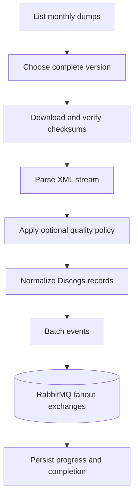

# Discogs extraction architecture

`discogs-ingestion` has one composition root and one provider mode. It discovers the
latest complete monthly Discogs dump set, verifies published checksums, streams the XML,
normalizes records, applies optional quality policy, and publishes batched events.



The default data root is `/discogs-data`. `PERIODIC_CHECK_DAYS` controls subsequent
checks; `DISCOGS_EXCHANGE_PREFIX` defaults to `groovemap-discogs`. `--force-reprocess`
forces the startup run, while `POST /trigger` accepts an optional JSON
`force_reprocess` boolean for a running service. Manual triggers and shutdown remain
local to this service. No MusicBrainz health endpoint, ordering rule, or shared lock
participates in a run.

## One-shot local smoke input

Released-image integration tests may explicitly select the operator/test-only local
manifest seam:

```bash
discogs-ingestion --local-manifest /fixtures/manifest.json
```

`LOCAL_MANIFEST` is the equivalent container configuration. This mode accepts the
versioned `groovemap.discogs-extractor-smoke` single-file manifest, verifies its relative
input path and SHA-256, stages the file under `DISCOGS_ROOT`, and runs it once through the
same parse, normalization, RabbitMQ publication, state-marker, and completion code used by
normal extraction. It exits after that run and never lists or downloads public Discogs
dumps. Missing inputs, malformed or unsupported manifests, path escapes, and checksum
mismatches stop the run before parsing or publication.

The default invocation does not select this seam: it still discovers the latest complete
monthly set (artists, labels, masters, releases, and the published checksum file), performs
HTTP acquisition, and enters the normal periodic-check loop. The canonical tiny manifest
and its synthetic release input live under `contracts/extractor-smoke/v1/`; deployment
tests should mount a reviewed immutable copy of that directory rather than introduce a
second fixture format.

The released container also packages that directory at
`/usr/share/discogs-ingestion/contracts/extractor-smoke/v1/`, so a digest-pinned image can
run its own fixture without any source checkout. Operators still have to pass
`--local-manifest /usr/share/discogs-ingestion/contracts/extractor-smoke/v1/manifest.json`
explicitly; the image sets no local-manifest default.

## The canonical `media` block

Normalization attaches a `media` block to every `releases` record, alongside the raw
`formats` list Discogs reported. `src/discogs/media.rs` maps that provider-shaped list
onto the media-neutral vocabulary vendored at
`contracts/catalog-events/vocab/media-taxonomy.json` -- one entry per physical or
digital unit, each carrying a canonical family and medium, size/speed/channel/codec
attributes, and release-level facts (kind, edition, packaging, container) -- so every
consumer reads one shape rather than re-deriving it from Discogs' free-text formats and
descriptions. The block is attached before the content hash is computed, so the hash
covers it. See [ADR 0007, "Canonical media taxonomy and media-neutral product
core"](https://github.com/groovemap-music/design/blob/main/docs/adr/0007-canonical-media-taxonomy.md)
and `contracts/catalog-events/README.md`.

`media` is **additive within v1**: it does not change the event schema or any existing
field, and a consumer that does not read it is unaffected.
`contracts/catalog-events/definitions/discogs.json` documents the exact shape via
`fixture_payloads.releases`, which pairs a representative `formats` payload with the
`media` block the mapper produces for it.
