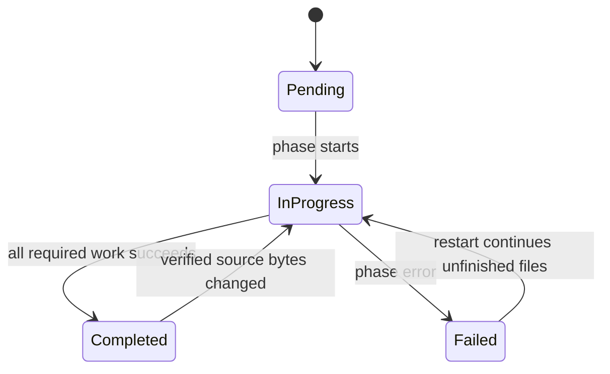

# State-marker system

State markers persist download and processing status for each source version. They let
a restarted process skip completed files, re-run incomplete work, report durable
progress, and avoid treating a previously completed version as new.

## Marker locations

For a Discogs version such as `20260101`, the marker is
`{DISCOGS_ROOT}/.extraction_status_20260101.json`. `DISCOGS_ROOT` defaults to
`/discogs-data`.

Markers contain four sections: `download_phase`, `processing_phase`,
`publishing_phase`, and `summary`. Phase statuses are `pending`, `in_progress`,
`completed`, or `failed`.

## Restart decisions

On startup the source loop chooses one of these actions:

| Action | Trigger | Behavior |
| --- | --- | --- |
| Fresh run | Forced run, no marker, or an unreadable marker | Build a fresh marker and process every file. |
| Reprocess | An interrupted or failed Discogs download before any file completed | Replace the loaded marker and process every file. |
| Continue | Processing is pending, in progress, or failed; or a Discogs download was interrupted after some files completed | Skip completed files and process every other file from its beginning. |
| Skip | The version summary is completed | Publish nothing and wait for the next check or trigger. |

Resume is file-granular. Periodic counts are operational checkpoints, not parser offsets;
an `in_progress` file is republished from record one. See [Periodic state-marker
checkpoints](state-marker-periodic-updates.md).

## Source-byte provenance

For Discogs, the marker links a completed processing result to the verified bytes that
produced it:

- `download_phase.downloads_by_file[file].checksum` identifies the file currently on
  disk.
- `processing_phase.progress_by_file[file].source_checksum` identifies the bytes used
  by that processing attempt.

If a later download verifies different bytes for the same filename, the completed
processing entry is removed, its counters are subtracted, and the file is re-queued.
Identical bytes do not force a reparse. Older markers with unknown provenance remain
loadable and are not invalidated speculatively.

## Durable writes

Marker saves use a temporary sibling file, synchronize its contents, atomically rename
it, and then synchronize the parent directory. A reader therefore never observes a
partially written JSON document, and completed phase transitions survive ordinary
process crashes and power-loss ordering hazards supported by the filesystem.

If a marker cannot be read or parsed, the loader logs a warning and returns no marker;
the source loop then starts from a fresh state. Marker files contain operational state,
not configuration, and must stay in mounted data roots rather than Git.

## Completion signals

A file is marked complete only after its `file_complete` event is accepted by the
broker. An extraction is marked complete only after every file succeeds and the
`extraction_complete` event is accepted. This ordering prevents a restart from skipping
a completion signal that was never delivered.
